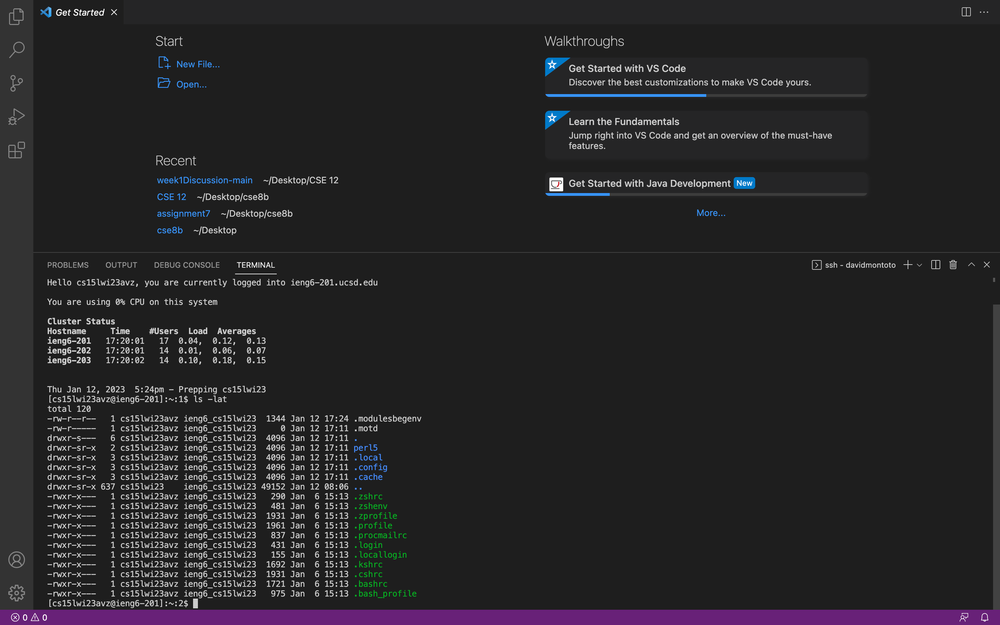

# Tutorial for Incoming CSE15L Students
## By David Montoto

> Hello all new CSE15L students. I am excited to explain some of the basics behind lab 1 and using a remote login. I have listed the steps __below__.

1. The first thing you should do it reset your "cs15lwi23---" password through the UCSD password reset website. When on this website, make sure to reset only the password for this login.               k

2. The next step is you need to download Visual Studio Code on your computer. After downloading, you should see a screen similar to the one shown below. 

3. The next step is to access the terminal in Visual Studio Code, by hovering your mouse over the bottom and dragging up. Now that you see the terminal, you can access the server by typing "ssh cs15lwi23---@ieng6.ucsd.edu". Then, type in your password to enter the server. You should see an image similar to the one below.

4. Once you are logged in, you can go ahead and try practicing various codes such as "ls" or "cd". When logged in, your computer becomes a client as your are also in the terminal within a computer in UCSD. Some code examples are shown below. 

