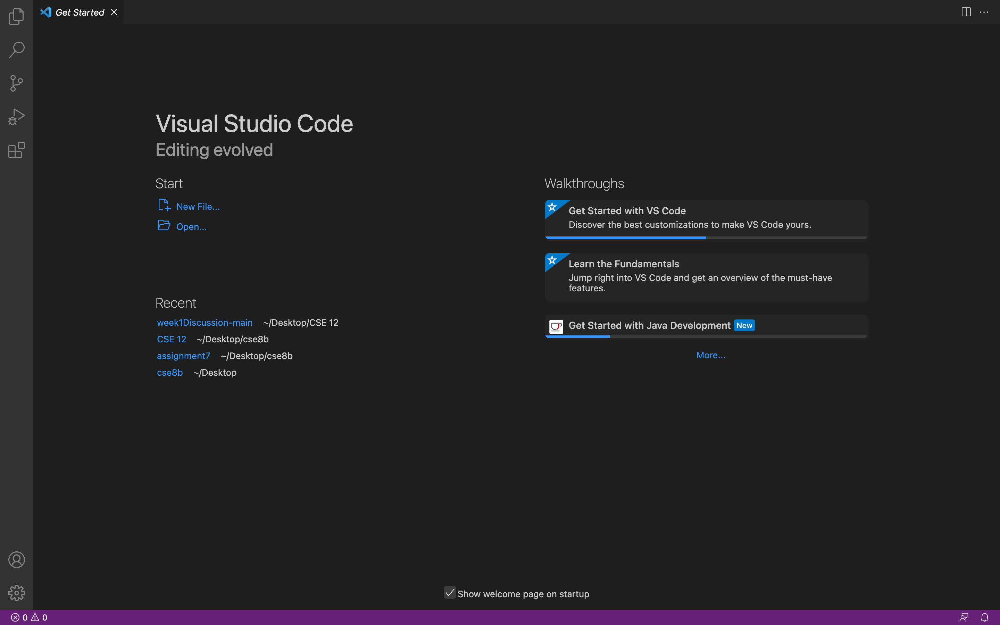
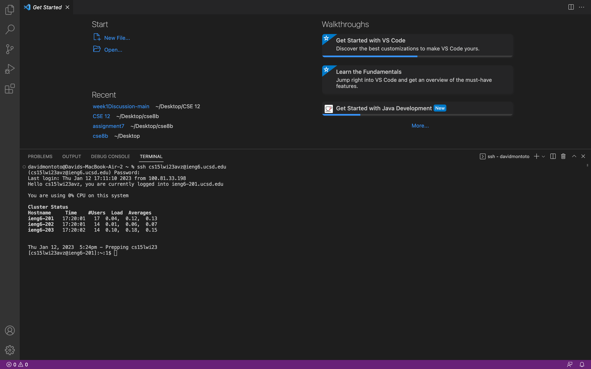

# Tutorial for Incoming CSE15L Students
## By David Montoto

> Hello all new CSE15L students. I am excited to explain some of the basics behind lab 1 and using a remote login. I have listed the steps __below__.

1. The first thing you should do it reset your "cs15lwi23---" password through the UCSD password reset website. When on this website, make sure to reset only the password for this login. [Click Here](https://sdacs.ucsd.edu/~icc/index.php). This action should take a few minutes to go through, so wait before checking for the password change.         

2. The next step is you need to download Visual Studio Code on your computer. When you click the download button, make sure you download the version specific to your computer (macOS or Windows). [Click Here](https://code.visualstudio.com/). After downloading, you should see a screen similar to the one shown below. ( After downloading, you should see a screen similar to the one shown below.

3. The next step is to access the terminal in Visual Studio Code, by hovering your mouse over the bottom and dragging up. Now that you see the terminal, you can access the server by typing `ssh cs15lwi23---@ieng6.ucsd.edu`. The three `---` in the code are letters unique to each user, so double check yours when logging into the server. Then, type in your password to enter the server. You should see an image similar to the one below.

4. Once you are logged in, you can go ahead and try practicing various codes such as `ls` or `cd`. When logged in, your computer becomes a client as your are also in the terminal within a computer in UCSD. Some code examples are shown below. 

5. The code shown above is important to understand. The command `ls -lat` lists all of the files in the server along with when they were last modified, their name and their size. This command is very similar to `ls`, which you can use in the VSCode terminal. `ls` will show all the files in the specific directory you are located in. To switch directories, you can use `cd`.

