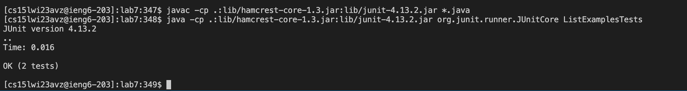

# Lab Report 4
## By David Montoto

### Debugging From the Terminal

In lab seven, we have been provided with two java files in a github file, being ListExamples.java and ListExamplesTests.java. Our goal is to remotely compile and run the testing methods contained within ListExamplesTests.java. However, there lies an intentional bug planted within one of the methods contains in ListExamples.java. Below, I will present the steps that I took to remotely clone the file, compile, debug, and run the tests all from the terminal. 

* Step 1: Below is the image associated with step one, being to remotely log into my ieng6.ucsd.edu account. The exact line that I typed was `ssh cs15lwi23avz@ieng6.ucsd.edu<enter>`. 

* Step 2: Below is the image associated with step two, which is to remotely clone the git file. The exact line used was `git clone git@github.com:dmmontoto/lab7.git<enter>`. You might notice how the line is different from the https:// link to clone the file. The reasoning behind this different is that I am using SSH Keys for GitHub.

* Step 3: The next step below is to change directory into the lab7 directory from what was just cloned. The line used is `cd lab7<enter>`.

* Step 4: The following step is compiling the files, with the exact code being `javac -cp -: Lib/hamcrest-core-1.3.jar: lib/junit-4.13.2.jar *.java<enter>`. We are compiling in this manner as we are using JUnit testing.

* Step 5: The next step is to run the files since we just compiled them from the terminal. The exact line of code is as follows `java -cp .:lib/hamcrest-core-1.3.jar:lib/junit-4.13.2.jar org.junit.runner.JUnitCore ListExamplesTests<enter>`. Here, you can identify how one of the two tests failed, implying that the code did not run as expected when I ran it from the terminal. The specific test that failed is associated with the method 'merge' within ListExamples.java.

* Step 6: The next step is to open up the file from the terminal, and identify the mistake in the code that is causing the test to fail. By typing `nano ListExamples.java<enter>`, I can open up the java file from the terminal, as seen below. 

* Step 7: Now that we are in the file, I can scan the specific method, `merge`, to find the error, which I do identify at line 43. Below, I move to the exact error which ic located at line 43. The code should be `index2 += 1` and not `index1 +=1`. I exactly typed `<down><down><down><down><down><down><down><down><down><down><down><down><down><down><down><down><down><down><down><down><down><down><down><down><down><down><down><down><down><down><down><down><down><down><down><down><down><down><down><down><down><down><right><right><right><right><right><right><right><right><right><right><right><right><delete>2^O<enter>^X`. After typing the code the terminal should return to how it looked before calling `nano ListExamples.java`.

* Step 8: The next step is to compile and run the code again to see if the tests now pass. By typing in `<up><up><up><up><up><up><enter><up><up><up><up><up><up><enter>`, I can go back to my compile and run lines ass seen below.

* Step 9: The next step is to commit and push. The next line I type is `git add ListExamples.java` as seen below.

![Image](
