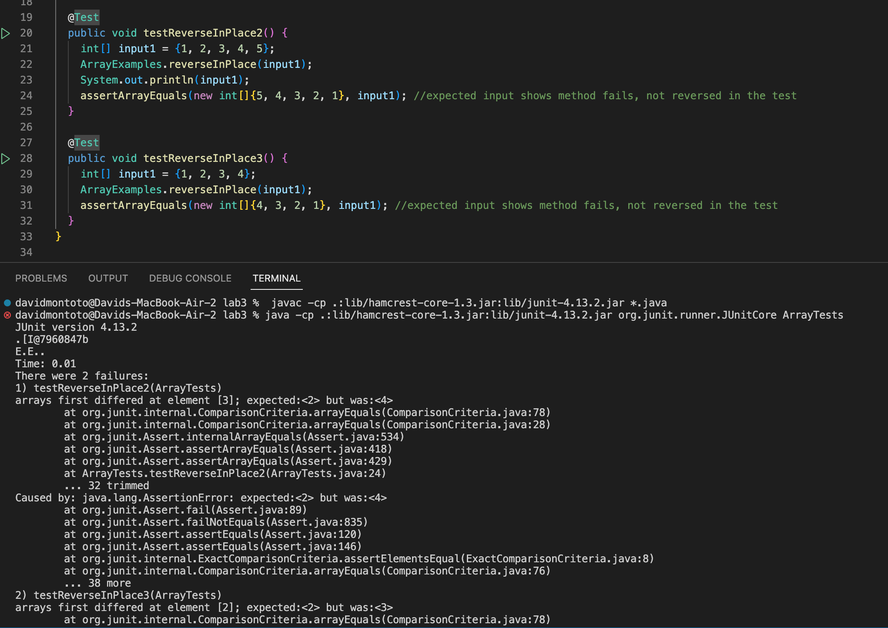
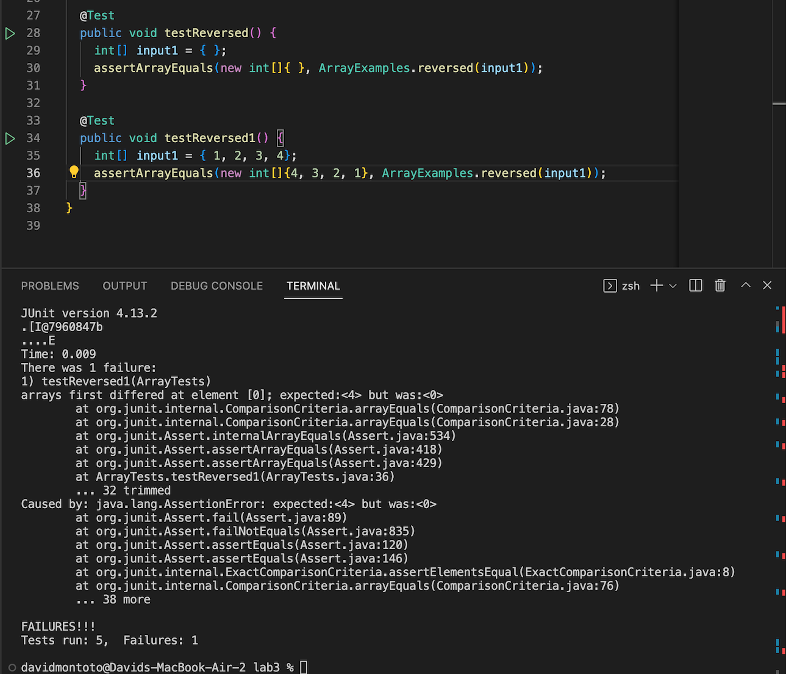

# Lab Report 2
## By David Montoto

### Part 1: StringServer.java

* Below is the code utilized in StringServer.java to create a server with a URL. The code also contains a method to take a string at the end of the URL and print it consecutively on the web page. The web page will print the strings at the end every time, keeping track of all of them. This stems from knowledge given in Lab 2, where we made a similar server that took in numbers, added them, and printed the total on the page.

```
class Handler implements URLHandler {
  String collectiveStrings = "";

  public String handleRequest(URI url) {
    if (url.getPath().equals("/")) {
      return String.format("");
    } else if (url.getPath().equals("/add")) {
      return String.format("" );
    } else {
      if (url.getPath().contains("/add")) {
        String[] parameters = url.getQuery().split("=");
          if (parameters[0].equals("s")) {
            collectiveStrings += "\n" + parameters[1]; 
            return collectiveStrings;
          }
       }
     return "404 Not Found!";
    }
  }
}

class StringServer {
  public static void main(String[] args) throws IOException {
    if(args.length == 0){
      System.out.println("Missing port number! Try any number between 1024 to 49151");
      return;
    }

    int port = Integer.parseInt(args[0]);

    Server.start(port, new Handler());
  }
}
```

* The following two screenshots demonstrate how the method `public String handleRequest(URI url)` works.


* In image one, I typed "localhost:2000/add-messae?s=Hello", which called `public String handleRequest(URI url)`. In the method, the first if and else if booleans are false, sending the call into the else case, where the Query is split at "=" and the second part is added to the string with "\n" in front, printing the string on a new line. When I typed "localhost:2000/add-messae?s=Goodbye" in the second image, the same method is called and the method resorts to the else statement because there is a message at the end of the url. This string is concatenated to the end of the string already holding previous strings like the one from image one. Notice how in image two you can see both "Hello" and "Goodbye".

### Part 2: arrayList Bug

* Below are two failure-inducing inputs as JUnit tests. They are for the two buggy methods provided in ArrayExamples.java, `reverseInPlace(int[] arr)` and `reversed(int[] arr)`.

```
@Test
public void testReverseInPlace2() {
  int[] input1 = {1, 2, 3, 4, 5};
  ArrayExamples.reverseInPlace(input1);
  assertArrayEquals(new int[]{5, 4, 3, 2, 1}, input1);
}

@Test
public void testReversed1() {
  int[] input1 = {1, 2, 3, 4};
  assertArrayEquals(new int[]{4, 3, 2, 1}. ArrayExamples.reversed(input1));
}
```

* Below are two inputs as JUnit tests, that do not induce a failure. The first test, for `reverseInPlace(int[] arr)`, fails to point out the bug because the array has a signle element, and the sympton is the same as the input. Test two, for `reversed(int[] arr)`, fails to point out the bug because the input is an emtpy array, and so is the symptom.

```
@Test
public void testReverseInPlace() {
  int[] input1 = { 3 };
  ArrayExamples.reverseInPlace(input1);
  assertArrayEquals(new int[]{ 3 }, input1);
}

@Test
public void testReversed() {
  int[] input1 = { };
  assertArrayEquals(new int[]{ }, ArrayExamples.reversed(input1));
}
```

* Below are the symptoms for `testReverseInPlace2()` and `testReversed1()`. In `testReverseInPlace2()`, the symptom you see in the terminal is `arrays first differed at element [3]; expected: <2> but was: <4>`. In `testReversed1()`, the symptom you see in the terminal is `arrays first differed at element [0]; expected: <4> but was:«0>`.



* Below is the code for `reverseInPlace(int[] arr)` and `reversed(int[] arr)` before any changes are made. `reverseInPlace(int[] arr)` is a method designed to take an input array and reverse the order of elements in this input array. `reversed(int[] arr)` is designed to take in a given input array and make a new copy of this array that is reversed.

```
static void reverseInPlace(int[] arr) {
  for(int i = 0; i < arr.length; i += 1) {
    arr[i] = arr[arr.length - i - 1];
  }
}

static int[] reversed(int[] arr) {
  int[] newArray = new int[arr.length];
  for(int i = 0; i < arr.length; i += 1) {
    arr[i] = newArray[arr.length - i - 1];
  }
  return arr;
}
```

* The bug in `reversedInPlace(int[] arr)` is that it does not have a way to store the values of the first half of the array, after they have been changed to the elements in the second half of the array. The code change necessary to fix this bug is creating a second integer array that is a direct copy of the input parameter “input 1.” This second copy will hold all the int values, so that when the first half of the integer array is reversed, the second half will also be. For the example, when the for loops iterates twice, making the array { 4, 3, 3, 4}, the next two iterations will make the array {4, 3, 2, 1} instead of keeping the array { 4, 3, 3, 4}. The second array has different reference variables. 

* The bug in `reversed(int[] arr` is that it sets the input array equal to the new array that is created, instead of the other way around. Now the new array will still be null because the indexes are never set to the old array in reverse. The input array is set to the values of the new array, so the solution is to change the inside of the for loop, making new array indexes equal to the reverse of the old array.

```
static void reverseInPlace(int[] arr) {
  int[] oldData = new int[arr.length];
  for(int i = 0; i < oldData.length; i += 1) {
    oldData[i] = arr[i];
  }
  for(int j = 0; j < arr.length; j +=1) {
    arr[j] = oldData[arr.length - j - 1];
  }
}

static int[] reversed(int[] arr) {
  int[] newArray = new int[arr.length];
  for(int i = 0; i < arr.length; i += 1) {
    newArray[i] = arr[arr.length - i - 1];
  }
  return newArray;
}
```

### Part 3: Understanding JUnit testing

   JUnit testing is something new I have been introduced to. Before taking both CSE 15L and CSE 12 this quarter, I have never used JUnit testing. Now, I have learned that even if code passes test cases, it might still contain a bug. Hence, utilizing JUnit testing to "break" your code is important to ensure no edge case or unique input could produce wrong symptoms. From now on, I am excited to create more test cases and try and find bugs. 
